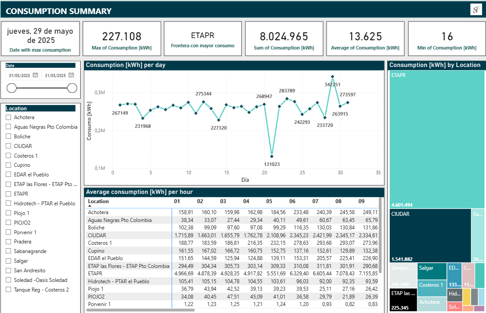

# ⚡ Automation of Energy Consumption Readings

This project automates the **download, consolidation, and analysis** of hourly consumption files from multiple energy frontiers.  
The pipeline ends with an **interactive Power BI dashboard** that provides real-time insights into total and per-frontier energy consumption.

---

## 📂 Project Structure

The repository contains three main **Python scripts**:

1. **`download_attachments.py`**  
   - Connects to **Outlook**.  
   - Automatically downloads email **attachments** and stores them locally.  
   - Attachments are **hourly consumption matrices** for different energy frontiers.  

2. **`consolidate_xlsx.py`**  
   - Reads all downloaded files.  
   - **Consolidates them into a single Excel file**, each matrix in its own sheet.  
   - Does not perform summations; it prepares clean data for BI use.  

3. **`sum_matrices.py`**  
   - Aggregates all frontier files.  
   - Produces a **single total consumption matrix**.  
   - Used as the base for global analysis in BI.  

---

## 📊 Power BI Dashboard

The final output is an **interactive Power BI report**, automatically updated from the processed Excel files.  
Key dashboard features:  

- **Total and per-frontier consumption**.  
- **Maximums and averages** per day and hour.  
- Dynamic visualizations: time-series charts, pivot-style tables, treemaps.  

 Dashboard:  

---

## 🚀 Technologies Used

- **Python** (automation & data processing):  
  - `pandas`, `openpyxl`, `os`, `datetime`, `win32com` (Outlook connection).  
- **Power BI** (visualization and interactive analytics).  
- **Outlook** (data source).  

---

## 📌 Workflow

1. 📧 **Receive** hourly consumption matrices via email.  
2. ⬇️ **Automatically download** attachments (`download_attachments.py`).  
3. 📑 **Consolidate** files into a single Excel workbook (`consolidate_xlsx.py`).  
4. ➕ **Aggregate** into one total consumption matrix (`sum_matrices.py`).  
5. 📊 **Visualize** in Power BI.  

---

## 🎯 Goal

To automate the **collection and processing of energy consumption data**, minimizing manual work and ensuring that information is always ready for **real-time business analysis**.

---

✍️ *Author: Sebastian Jaimes G.*
