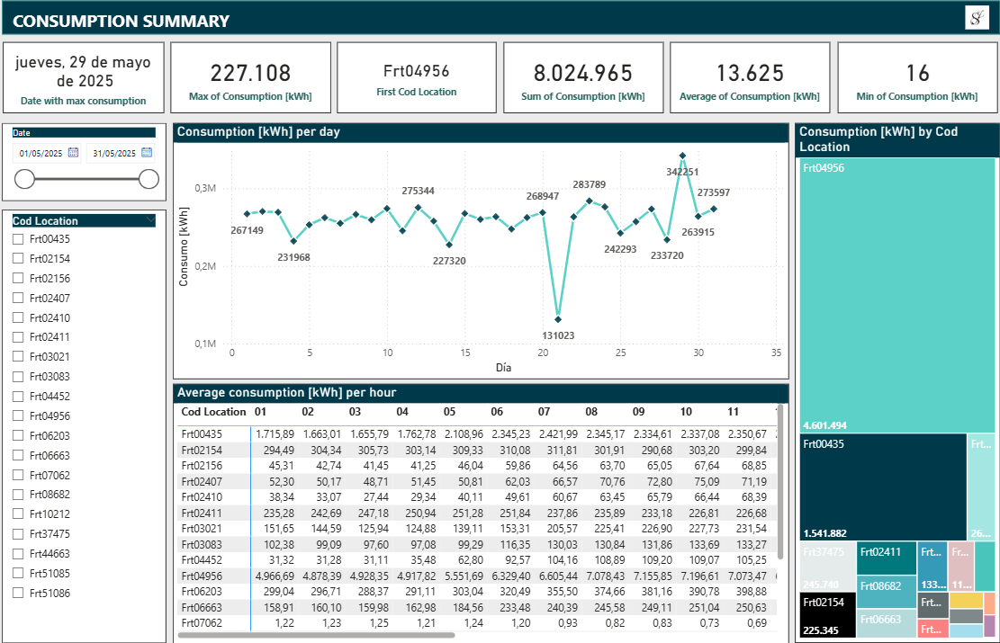

# ⚡ Automation of Energy Consumption Readings

This project automates the **download, consolidation, and analysis** of hourly consumption files from multiple energy frontiers.  
The pipeline ends with an **interactive Power BI dashboard** that provides real-time insights into total and per-frontier energy consumption.

## 🎯 Goal

To automate the **collection and processing of energy consumption data**, minimizing manual work and ensuring that information is always ready for **real-time business analysis**.

## 📂 Project Structure

```
Automation_of_readings/
│── Attachments/              # Raw attachments (input)
│── Processed_data/           # Processed data (output from .py files)                  
│   ├── consolidated.xlsx
│   └── total_consumption.xlsx
│── Images/                   # Screenshots for the README
│── Scripts/                  # All Python code
│   ├── consolidate_xlsx.py
│   ├── download_attachments.py
│   └── sum_matrices.py
│── BI.pbix                   # Power BI Project
│── README.md
```

## 📌 Workflow

1. 📧 **Receive** hourly consumption matrices via email.  
2. ⬇️ **Automatically download** attachments (`download_attachments.py`).  
3. 📑 **Consolidate** files into a single Excel workbook (`consolidate_xlsx.py`).  
4. ➕ **Aggregate** into one total consumption matrix (`sum_matrices.py`).  
5. 📊 **Visualize** in Power BI.  

## 📊 Power BI Dashboard

The final output is an **interactive Power BI report**, automatically updated from the processed Excel files.  
Key dashboard features:  

- **Total and per-frontier consumption**.  
- **Maximums and averages** per day and hour.  
- Dynamic visualizations: time-series charts, pivot-style tables, treemaps.  

 Dashboard:  



## 🚀 Technologies Used

- **Python** (automation & data processing):  
  - `pandas`, `openpyxl`, `os`, `datetime`, `win32com` (Outlook connection).  
- **Power BI** (visualization and interactive analytics).  
- **Outlook** (data source).  

---

✍️ *Author: Sebastian Jaimes G.*
