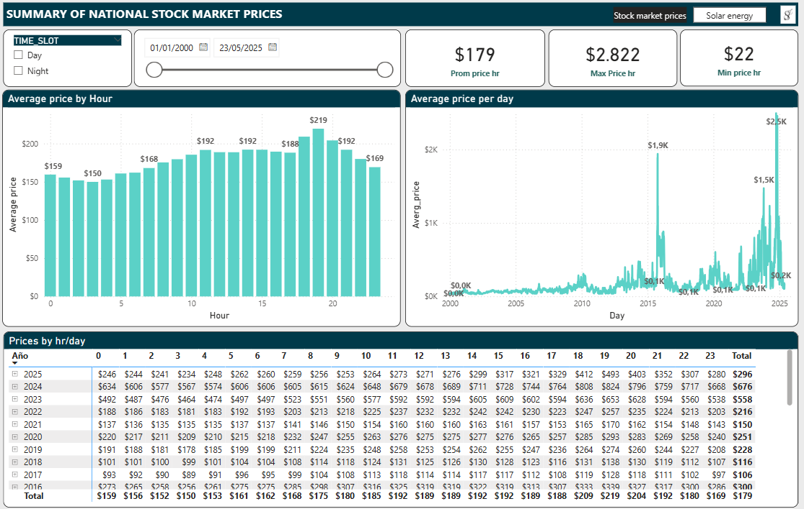
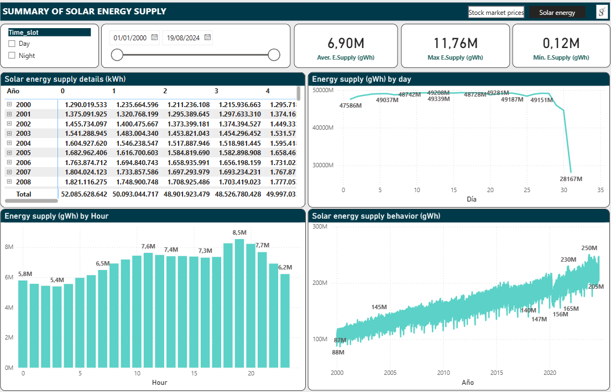

# Prices and National Solar Energy Demand

This project demonstrates a simple **ETL pipeline with Python and Power BI**. The main goal is to transform electricity market data from **wide format to long format** using Python, and then visualize and analyze it in **Power BI** with DAX transformations.

## Project Structure

```
📂 Data  
 ┣ 📄 Original_energy_supply.xlsx  
 ┣ 📄 original_prices.xlsx  
 ┣ 📄 Processed_energy_supply.xlsx  
 ┗ 📄 processed_prices.xlsx  
📂 Images
 ┣ 📄 prices_dashboard.png 
 ┣ 📄 Solar_energy_dashboard.png

📄 transform.py  
📄 Prices and national energy supply.pbix  [View Power BI Dashboard]
```

* **transform.py** → Python script that reshapes raw Excel files (wide → long format).
* **Data/** → Contains input and output datasets:

  * `Original_energy_supply` and `original_prices`: raw data.
  * `Processed_energy_supply` and `processed_prices`: cleaned and reshaped data ready for Power BI.
* **Prices and national energy supply.pbix** → Power BI report with dashboards and DAX transformations.

## Workflow

1. **Data Transformation (Python)**

   * Raw Excel files are often in **wide format**, with many columns representing dates/hours.
   * Using `pandas`, the script `transform.py` reshapes the files into **long format** for easier analysis.

2. **Data Modeling (Power BI)**

   * Processed files are loaded into Power BI.
   * Additional transformations and calculated measures are applied using **DAX**.
   * Dashboards provide insights into **prices** and **electricity demand** at different time granularities (hour/day).

## Dashboards

### National Market Prices

* Average hourly and daily prices.
* Maximum and minimum values.
* Hour-by-hour price matrix for each month.
  
  

### Solar energy supply

* Hourly and daily (GWh).
* Minimum, maximum, and average supply.
* Hourly supply patterns across the day.
  
  

## Technologies Used

* **Python (pandas)** → Data reshaping and preprocessing.
* **Power BI (DAX, visualization)** → Data modeling and interactive dashboards.
* **Excel** → Raw and processed datasets.


